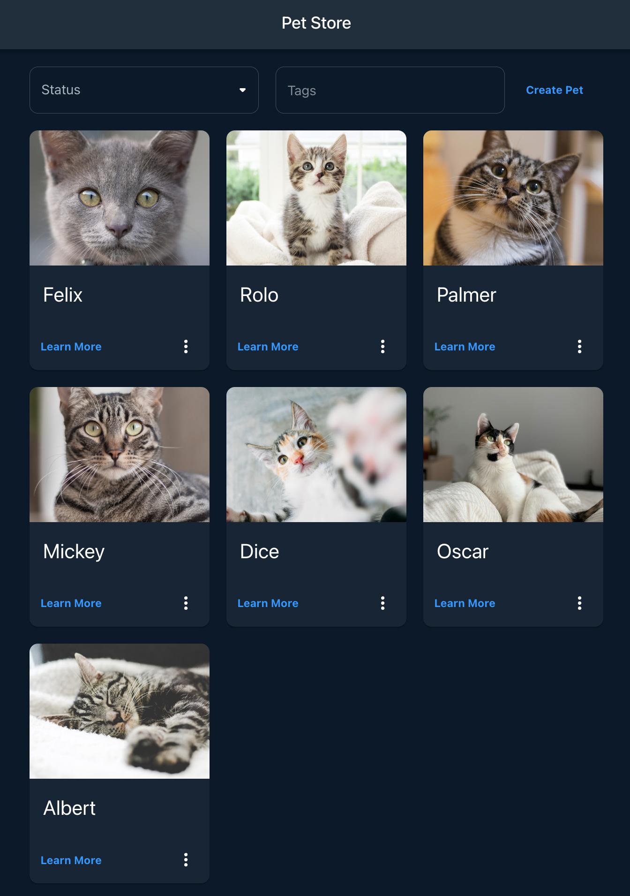

### Used technologies
- NestJS;
- PostgreSQL;
- TypeORM;
- Swagger (OpenAPI);
- Docker;
- Docker Compose;
- Jest;
- Supertest;
- ESLint;
- Prettier;
- React;
- React Hooks;
- Vite;
- Material-UI;
- Mock Service Worker;

### How to run the project
1. Clone the repository;
2. Copy the `.env.example` file to `.env` and fill in the environment variables;
```bash
cp .env.example .env
cp ./frontend/.env.example ./frontend/.env
```
3. Run `docker-compose up` in the root directory of the project:
```bash
docker-compose up -d --force-recreate --build
```
The application will be available at `http://localhost:8080/`.

### How to run the tests:
For running the backend tests, run the following command:
```bash
yarn test
```
If you want to run component tests, run the following command:
```bash
docker run -d \
    --name db-e2e \
    -e POSTGRES_DB=my_database \
    -e POSTGRES_USER=postgres \
    -e POSTGRES_PASSWORD=mysecretpassword \
    -p 5433:5432 \
    postgres:alpine
export $(cat .env.e2e) && yarn typeorm:run-migrations && yarn test:e2e
```
For running the frontend tests, run the following command:
```bash
cd frontend
yarn test
```